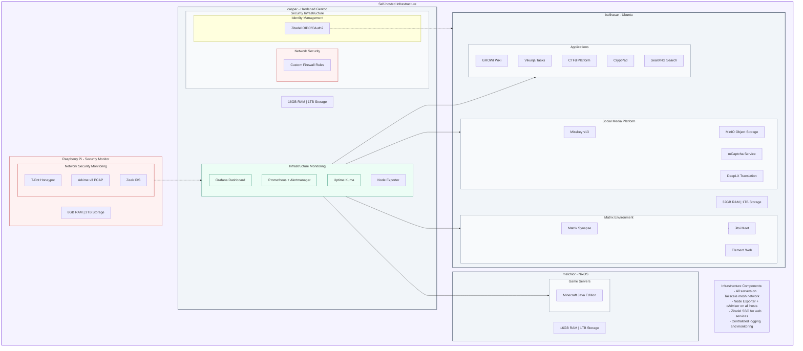

# hosted-list

```mermaid
graph TB
    %% Style definitions
    classDef homeServer fill:#f1f5f9,stroke:#475569,stroke-width:2px
    classDef service fill:#f8fafc,stroke:#64748b,stroke-width:1px
    classDef monitoring fill:#ecfdf5,stroke:#047857,stroke-width:1px
    classDef security fill:#fef2f2,stroke:#b91c1c,stroke-width:1px
    classDef network fill:#f5f3ff,stroke:#6d28d9,stroke-width:2px

    subgraph tailscale[Self-hosted Infrastructure]
        %% Security & Monitoring Core
        subgraph caspar[caspar - Hardened Gentoo]
            caspar_spec["16GB RAM | 1TB Storage"]
            subgraph security[Security Infrastructure]
                subgraph identity[Identity Management]
                    zitadel[Zitadel OIDC/OAuth2]
                end
                subgraph firewall[Network Security]
                    fw[Custom Firewall Rules]
                end
            end
            subgraph monitoring[Infrastructure Monitoring]
                grafana[Grafana Dashboard]
                prometheus[Prometheus + Alertmanager]
                uptime[Uptime Kuma]
                node_exp[Node Exporter]
            end
        end

        %% Application Server
        subgraph balthasar[balthasar - Ubuntu]
            balthasar_spec["32GB RAM | 1TB Storage"]
            subgraph social[Social Media Platform]
                misskey[Misskey v13]
                minio[MinIO Object Storage]
                mcaptcha[mCaptcha Service]
                deeplx[DeepLX Translation]
            end
            
            subgraph matrix[Matrix Environment]
                synapse[Matrix Synapse]
                element[Element Web]
                jitsi[Jitsi Meet]
            end
            
            subgraph apps[Applications]
                growi[GROWI Wiki]
                vikunja[Vikunja Tasks]
                ctfd[CTFd Platform]
                cryptpad[CryptPad]
                searxng[SearXNG Search]
            end
        end

        %% Gaming Server
        subgraph melchior[melchior - NixOS]
            melchior_spec["16GB RAM | 1TB Storage"]
            subgraph game[Game Servers]
                minecraft[Minecraft Java Edition]
            end
        end

        %% Network Security Monitoring
        subgraph raspi[Raspberry Pi - Security Monitor]
            raspi_spec["8GB RAM | 2TB Storage"]
            subgraph nsm[Network Security Monitoring]
                tpot[T-Pot Honeypot]
                arkime[Arkime v3 PCAP]
                zeek[Zeek IDS]
            end
        end

        %% Service Dependencies
        zitadel -.-> balthasar
        nsm -.-> monitoring
        monitoring --> social
        monitoring --> matrix
        monitoring --> apps
        monitoring --> game
        social --> minio
        matrix --> jitsi

        %% Notes
        note["Infrastructure Components:
        - All servers on Tailscale mesh network
        - Node Exporter + cAdvisor on all hosts
        - Zitadel SSO for web services
        - Centralized logging and monitoring"]
    end

    %% Apply styles
    class caspar,balthasar,melchior homeServer
    class security,social,matrix,apps,game service
    class monitoring,prometheus,grafana,uptime monitoring
    class raspi,nsm,firewall security
    class tailscale network
```
