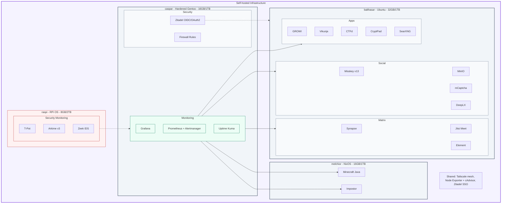

# hosted-list

```mermaid
graph TB
    %% Style definitions
    classDef homeServer fill:#f1f5f9,stroke:#475569,stroke-width:2px
    classDef service fill:#f8fafc,stroke:#64748b,stroke-width:1px
    classDef monitoring fill:#ecfdf5,stroke:#047857,stroke-width:1px
    classDef security fill:#fef2f2,stroke:#b91c1c,stroke-width:1px
    classDef network fill:#f5f3ff,stroke:#6d28d9,stroke-width:2px
    subgraph tailscale[Self-hosted Infrastructure]
        subgraph caspar[caspar - Hardened Gentoo - 16GB/1TB]
            subgraph security[Security]
                zitadel[Zitadel OIDC/OAuth2]
                fw[Firewall Rules]
            end
            subgraph monitoring[Monitoring]
                grafana[Grafana]
                prometheus[Prometheus + Alertmanager]
                uptime[Uptime Kuma]
            end
        end
        subgraph balthasar[balthasar - Ubuntu - 32GB/1TB]
            subgraph social[Social]
                misskey[Misskey v13]
                minio[MinIO]
                mcaptcha[mCaptcha]
                deeplx[DeepLX]
            end
            subgraph matrix[Matrix]
                synapse[Synapse]
                element[Element]
                jitsi[Jitsi Meet]
            end
            subgraph apps[Apps]
                growi[GROWI]
                vikunja[Vikunja]
                ctfd[CTFd]
                cryptpad[CryptPad]
                searxng[SearXNG]
            end
        end
        subgraph melchior[melchior - NixOS - 16GB/1TB]
            minecraft[Minecraft Java]
            impostor[Impostor]
        end
        subgraph raspi[raspi - RPi OS - 8GB/2TB]
            subgraph nsm[Security Monitoring]
                tpot[T-Pot]
                arkime[Arkime v3]
                zeek[Zeek IDS]
            end
        end
        %% Dependencies
        zitadel -.-> balthasar
        nsm -.-> monitoring
        monitoring --> social & matrix & apps & minecraft & impostor
        social --> minio
        matrix --> jitsi
        %% Note
        note["Shared: Tailscale mesh, Node Exporter + cAdvisor, Zitadel SSO"]
    end
    %% Apply styles
    class caspar,balthasar,melchior homeServer
    class security,social,matrix,apps service
    class monitoring,prometheus,grafana,uptime monitoring
    class raspi,nsm security
    class tailscale network
```
